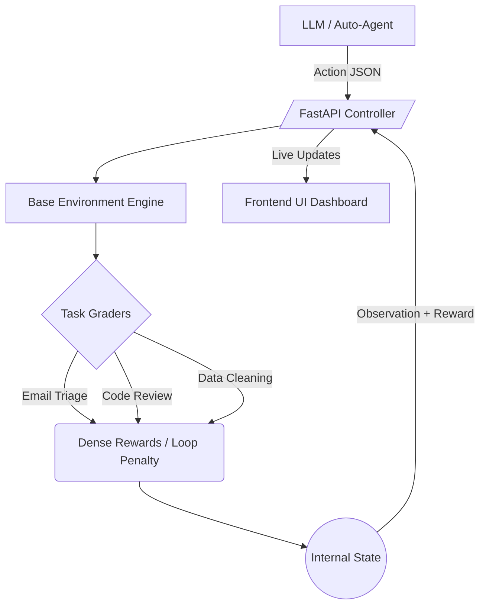

# Heapify Autonomous RL System

<div align="center">
  <br />
  
  
  
  <br />
  <p><h3>A Deterministic Reinforcement Learning Environment for Language Agent Evaluation</h3></p>
</div>

---

## Overview

**Heapify** is a strictly deterministic Reinforcement Learning environment designed for evaluating and visualizing Large Language Model (LLM) agents. 

Built entirely with standard libraries and served via FastAPI, this system provides a highly responsive, zero-dependency HTML/JS/CSS frontend—crafted in a minimal IDE aesthetic—to visualize the RL pipeline in real-time.

### Key Capabilities
* **Dense Reward Tracking:** Granular scoring systems (+0.3 for correct reasoning, -0.5 to -1.0 logic loop penalties).
* **Auto-Agent Mode:** An asynchronous controller that interfaces with standard LLM inference endpoints.
* **Episode Consistency:** Strict RL lifecycle enforcement. Task switching is disabled during active episodes to ensure uncorrupted evaluation metrics.
* **Minimalist Interface:** High-contrast, responsive UI with auto-scrolling execution logs, active step tracking, and dynamic action spaces.

---

## System Architecture



---

## Installation & Setup

1. **Clone the Repository**
```bash
git clone https://github.com/rohan-chand-m-01/RL_Environment.git
cd RL_Environment
```

2. **Install Dependencies**
Ensure you have Python 3.9+ installed, then run:
```bash
pip install -r requirements.txt
```

3. **Set Environment Variables**
Configure your provider credentials securely (do not commit these):
```bash
export HF_TOKEN="your_token_here"
export API_BASE_URL="api_url_here"
export MODEL_NAME="model_string_here"
```

4. **Launch the Server**
```bash
python server.py
```
> The application will be live at `http://localhost:7860`.

---

## Task Ecosystem

The environment currently supports three modular objective pipelines:

1. **Email Triage:** Classify incoming contexts into discrete labels.
2. **Code Review:** Detect syntax anomalies and apply logical patch configurations.
3. **Data Cleaning:** Handle database integrity constraints through normalized metrics and schema resolution.

---

<div align="center">
  <i>Deterministic execution for autonomous agents.</i>
</div>
